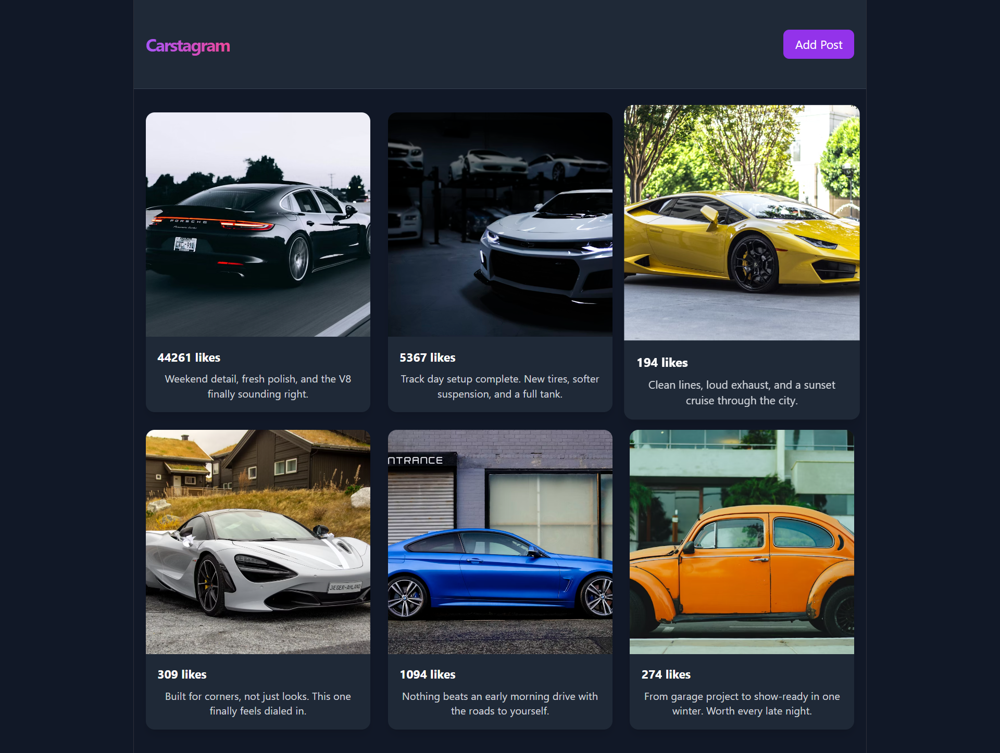

# Batch Processing for Instagram-like Like System

In this project, I demonstrate how Instagram handles millions of like requests on the server using batch processing. While in real life Instagram uses a mix of Kafka and Redis, this project focuses solely on Redis as a caching service to showcase the core concept.



## What is Batch Processing?

Batch processing is a method where you initially collect multiple items before performing an action on them all at once. 

For example, a delivery boy doesn't deliver boxes one by one (going to the warehouse, picking one product, delivering it, and repeating). Instead, he collects multiple deliveries and delivers them all to their respective locations in batches.

## Project Overview

This project simulates how social media platforms efficiently handle high volumes of user interactions by implementing batch processing to reduce database load.

### Components

The project consists of two main parts:
1. **Backend** - Handles the logic and data processing
2. **Frontend** - Provides the user interface

### Frontend Features

The frontend includes two buttons:
- Normal like button
- Bombard likes button (sends 1000 likes using a for loop)

Additionally, there's a polling system that updates each post every 5 seconds to reflect any changes in like counts.

### Backend Architecture

The backend implements Redis as a caching layer (running on Docker) to store likes temporarily. Instead of updating the database with each individual like, the backend runs a polling function that checks Redis every 5 seconds. If likes are found in the cache, they are transferred to the database all at once, preventing thousands of individual database requests that could cause issues in a real production environment.

### Backend Routes

1. `GET /posts` - Sends all posts to the frontend
2. `GET /posts/likes` - Sends the count of likes for each post to support the frontend polling system
3. `POST /posts/{post_id}/likes` - Updates the like count for a specific post by 1 in Redis (not in the actual database)


## Manual Installation (Alternative)

### Backend Setup

1. Navigate to the Backend directory:
   ```
   cd Backend
   ```

2. Create a virtual environment:
   ```
   python -m venv venv
   ```

3. Activate the virtual environment:
   - On Windows: `venv\Scripts\activate`
   - On macOS/Linux: `source venv/bin/activate`

4. Install the required packages:
   ```
   pip install -r requirements.txt
   ```

5. Start Redis server (requires Docker):
   ```
   docker run -d -p 6379:6379 redis:7-alpine
   ```

6. Run the backend:
   ```
   python db.py  # Initialize database with sample data
   uvicorn main:app --reload
   ```

### Frontend Setup

1. Navigate to the Frontend directory:
   ```
   cd Frontend
   ```

2. Install dependencies:
   ```
   npm install
   ```

3. Start the development server:
   ```
   npm run dev
   ```

4. Open your browser and visit http://localhost:5173

## Contributing

Opinions are always welcome! If you find something that can be improved, please feel free to contribute or share your suggestions.